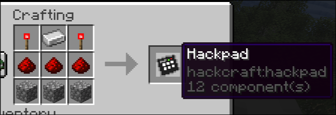
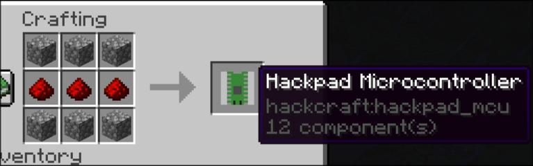
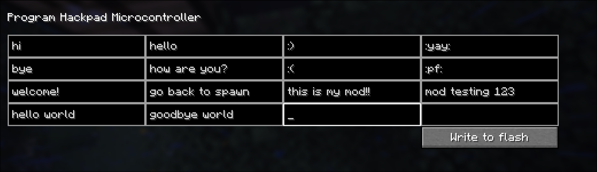
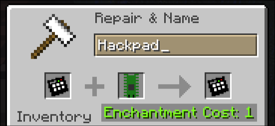
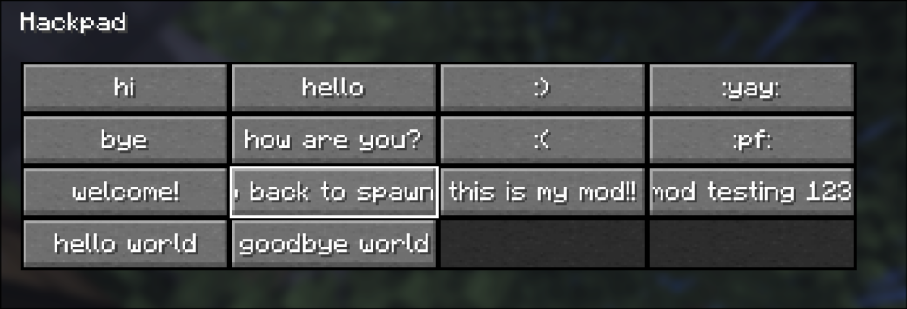

# HackCraft: Hackpad Edition

  <h2>
    Download at <a href="https://modrinth.com/project/hackcrafts-hackpad">Modrinth</a> |
    Watch the demo at <a href="https://www.youtube.com/watch?v=qdPrmCf7WGQ">YouTube</a>
  </h2>

This mod adds
two items. A hackpad and a hackpad MCU.
## Crafting Recipes
### Hackpad

### Hackpad MCU

## Usage
1. Open the MCU GUI

You can type different messages into each of the MCU's fields.
After that, click on "Write to Flash"
2. Anvil the MCU into the hackpad

Open an anvil and forge the MCU onto the Hackpad
3. Open the Hackpad

Now when you open the Hackpad and click on one of the set messages, the message will be sent to the chat.

This can be useful as a quick chat menu, to quickly send frequently typed messages.
# Credits
- https://github.com/FMG9167 Thank you very very much for helping with the anvil recipe creation thingy
- @felix on Slack for helping me with literally whatever I need help with
- @BetterClient on Slack for helping me get started (honestly HUGE help from him!!)
